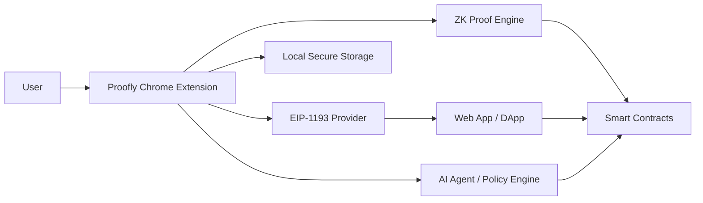

# Proofly
## zk-Humanity Wallet for the AI Era
### Real-Only End-to-End Product Spec

**Status:** Canonical build brief  
**Rule:** No mocks, no placeholder flows, no simulated trust. Every user-visible action in this document is meant to be implemented with real components, real signatures, real proofs, and real chain interactions.

---

## 1. What Proofly is

Proofly is a Chrome-extension wallet and trust layer that lets a person:

1. prove they are a real human,
2. sign actions with their own wallet,
3. authorize AI agents with strict permissions,
4. verify content or transactions with a privacy-preserving proof trail.

The wallet is the product. The zero-knowledge layer is the trust engine. The chain is the enforcement layer. The website is the user surface.

---

## 2. What Proofly is not

Proofly is not a mock demo, not a login button, not a fake wallet UI, and not a screenshot of a product idea.

It is also not:
- a custodial wallet,
- a KYC replacement,
- a synthetic prototype,
- a temporary proof-of-concept with fake backend responses,
- a design-only concept.

If a feature appears in the final product experience, it must have a real implementation path behind it.

---

## 3. Product thesis

The web has a trust problem.

Bots can create accounts, claim rewards, submit tasks, mass-sign actions, generate fake content, and imitate human behavior. Existing wallets prove control of keys, but they do not prove that the actor is human, that the action was intentionally authorized, or that an AI agent stayed inside a human-defined policy boundary.

Proofly solves that by combining:
- a real browser wallet,
- zero-knowledge human proof,
- wallet-native signing,
- chain-based verification,
- policy-limited delegation to AI agents.

The promise is simple:

**Trust without identity leakage.**

---

## 4. Core product pillars

### 4.1 Human proof
The wallet proves that the holder is a real human without exposing personal identity.

### 4.2 Signed action
The wallet signs messages, session grants, and transactions in a standard wallet-compatible way.

### 4.3 AI leash
The wallet gives an AI agent a bounded mandate:
- what it may do,
- how much it may spend,
- when it may act,
- which contracts it may touch,
- which assets it may use.

### 4.4 Human-source content signing
The wallet can attach a proof-backed signature trail to media or message workflows so a verifier can see that the source was wallet-authorized and human-backed.

---

## 5. Final product shape

Proofly has two main surfaces:

### A. The Chrome extension wallet
This is the actual identity and signing surface.

### B. The web app
This is the dApp, marketplace, or agent console that consumes the wallet’s proofs and signatures.

The extension does the trust work. The web app reads the trust result and unlocks functionality.

---

## 6. Build principle

Every feature must be implemented as one of these:

- local wallet operation,
- standard provider interaction,
- zero-knowledge proof flow,
- smart contract verification,
- backend verification or logging,
- permission engine enforcement.

If something is only a visual trick, it does not belong in the final product.

---

## 7. Official standards and real dependencies

Proofly should be built on real, current platform and identity standards:

- Chrome Extension Manifest V3 for the wallet extension structure.
- EIP-1193 for the provider interface so dApps can connect to the wallet.
- EIP-6963 for multi-wallet discovery.
- World ID / IDKit for proof-of-human flows.
- Polygon ID for credential and role proofs.
- Solidity smart contracts for on-chain enforcement on EVM networks.

---

## 8. System architecture



### Meaning of the architecture
- The user controls the extension.
- The extension stores keys and permissions locally.
- The extension exposes a standard provider to dApps.
- The extension generates or verifies zero-knowledge proofs.
- The chain stores verification outcomes and policy state.
- The web app consumes the result.
- The AI agent is always bounded by wallet policy.

---

## 9. Chrome extension wallet architecture

Proofly should be a Manifest V3 Chrome extension with the following modules:

### Root files
- `manifest.json`
- `background.serviceworker.ts`
- `contentScript.ts`
- `injectedProvider.ts`
- `popup.html`
- `popup.tsx`
- `options.html`
- `options.tsx`

### Internal modules
- `wallet/keys.ts`
- `wallet/signing.ts`
- `wallet/chains.ts`
- `wallet/storage.ts`
- `wallet/recovery.ts`
- `provider/eip1193.ts`
- `provider/events.ts`
- `zk/worldId.ts`
- `zk/polygonId.ts`
- `policy/agentRules.ts`
- `policy/sessionRules.ts`
- `policy/allowlists.ts`
- `media/audioHash.ts`
- `media/signMedia.ts`
- `backend/apiClient.ts`

### What each module does
- `keys.ts`: generate, import, rotate, export, and derive addresses.
- `signing.ts`: sign messages, typed data, and transactions.
- `chains.ts`: manage chain RPCs, chain IDs, explorers, and network switching.
- `storage.ts`: encrypt and store secrets locally.
- `eip1193.ts`: expose wallet methods to dApps.
- `worldId.ts`: manage human verification proof flow.
- `polygonId.ts`: manage credential proofs and role claims.
- `agentRules.ts`: enforce AI spending and permission limits.
- `audioHash.ts`: hash audio locally before signing.
- `signMedia.ts`: attach wallet signature and proof metadata to media workflows.

---

## 10. Wallet lifecycle

### 10.1 First install
- Extension loads.
- User sees create wallet or import wallet.
- User sets a local password.
- A seed phrase is generated or imported.
- Private keys are encrypted before storage.
- The wallet derives the active account address.

### 10.2 Normal unlock
- User opens the extension.
- User unlocks with password or recovery method.
- Extension decrypts key material locally.
- Provider becomes available to dApps.

### 10.3 Wallet connection to dApp
- DApp requests accounts through the provider.
- Extension shows a human-readable approval screen.
- User approves the connection.
- Provider returns the selected account.

### 10.4 Signing
- DApp requests message or transaction signing.
- Extension shows the exact content to sign.
- User approves or rejects.
- Signature is returned to the dApp.

### 10.5 Proof verification
- User launches human verification.
- Wallet requests a real proof flow from the selected ZK provider.
- Proof result is stored.
- The wallet exposes verified state to the dApp or contract.

---

## 11. Human proof implementation

Proofly should support at least one real proof-of-human provider in v1 and should be designed to add more later.

### Recommended first provider
World ID / IDKit.

### Why
- It is a real proof-of-human system.
- It is already designed for privacy-preserving human verification.
- It can be used in dApps and contract-gated flows.
- It fits the anti-bot story cleanly.

### Wallet-side behavior
1. User clicks “Verify Human.”
2. Extension launches the proof flow.
3. Proof and nullifier are returned.
4. Extension stores proof state locally.
5. Extension can optionally forward proof data to backend or smart contract.
6. Verified state becomes visible in the wallet.

### Result
The wallet can now prove:
- human presence,
- uniqueness for the action,
- privacy-preserving trust.

---

## 12. Credential proof implementation

Proofly should also support credential proofs through Polygon ID or an equivalent credential system.

### Use cases
- verified worker,
- verified doctor,
- verified student,
- verified moderator,
- verified institution member,
- verified task specialist.

### Wallet behavior
1. User receives or imports a credential.
2. Wallet stores credential state locally or via approved credential store.
3. Wallet generates a proof for a requested attribute.
4. DApp or contract verifies the proof.
5. Access is granted only if the claim matches the rule.

This is how Proofly grows from “human proof” into a broader identity vault.

---

## 13. AI leash implementation

The AI leash is a real permission system, not a visual demo.

### Core policy fields
- spending limit,
- token allowlist,
- contract allowlist,
- call-type allowlist,
- expiration time,
- network allowlist,
- recipient allowlist,
- nonce constraints,
- approval requirements.

### Example policy
- may spend up to 50 USDC,
- may only call approved contracts,
- may act for 10 minutes,
- may only operate on one chain,
- may not approve token transfers outside the allowlist.

### Enforcement model
- Policy is created by the user inside the wallet.
- Policy is stored locally and optionally mirrored on-chain.
- Agent requests must pass policy checks before signing.
- Requests outside policy are rejected.
- Policy violations are visible in the extension UI.

### Real enforcement
The AI cannot bypass the wallet because the wallet is the signing authority.

---

## 14. Voice and media signing

Proofly should support signed media trails for audio and message workflows.

### What this means
The wallet does not need to claim it can “recognize voice identity” by magic. Instead, it does something stronger and more defensible:

- hashes the audio file locally,
- signs the hash with the wallet key,
- optionally binds the signature to a human-proof state,
- exposes a verification package that another app can check.

### Workflow
1. User records or uploads audio.
2. Wallet computes a stable hash.
3. Wallet signs the hash.
4. Wallet attaches verified human state if available.
5. Recipient verifies:
   - the signature,
   - the wallet address,
   - the proof state,
   - the policy context.

This gives a real source trail without pretending the wallet can do impossible media forensics.

---

## 15. Chain support strategy

Proofly should be chain-agnostic at the provider level but EVM-first at launch.

### Supported first wave
- Ethereum-compatible chains,
- major EVM testnets,
- later, selected mainnets.

### Chain registry fields
- chain ID,
- RPC URL,
- explorer URL,
- native token,
- gas settings,
- contract addresses,
- support flags,
- proof support status.

### Network switching
The wallet must let the user switch networks with explicit approval.

### Chain behavior
- signing is chain-specific,
- proof metadata is chain-aware,
- contract verification is chain-bound,
- permissions can be scoped to a chain.

---

## 16. Provider contract

Proofly must expose an EIP-1193-compatible provider so dApps can interact with it in a standard way.

### Required methods
- `eth_requestAccounts`
- `eth_accounts`
- `eth_chainId`
- `personal_sign`
- `eth_signTypedData_v4`
- `eth_sendTransaction`
- `wallet_switchEthereumChain`
- `wallet_addEthereumChain`

### Required events
- `connect`
- `disconnect`
- `accountsChanged`
- `chainChanged`

### Multi-wallet discovery
Proofly should also follow the multi-provider discovery model so it behaves correctly alongside other wallets in the browser.

---

## 17. Secure storage and key management

### Local key handling
- Generate keys locally.
- Encrypt all sensitive material.
- Store only encrypted material at rest.
- Never send private keys to a server.
- Never expose raw seed phrases to any remote service.

### Recovery
- seed phrase backup,
- encrypted local backup,
- optional social or device-based recovery later,
- never default to custodial recovery.

### Rotation
- support key rotation,
- support account migration,
- support wallet locking and unlocking,
- support session expiration.

---

## 18. Web app / dApp behavior

The web app is the consumer of the wallet’s trust output.

### DApp capabilities
- connect to wallet,
- request human verification,
- display proof state,
- request signatures,
- read chain state,
- gate tasks,
- read policy outcomes,
- request AI delegation,
- verify signed media trails.

### Marketplace / worker flow
- user connects wallet,
- user proves humanhood,
- marketplace checks verification,
- tasks unlock,
- submission is signed and logged,
- rewards are gated by proof status.

### Agent console flow
- user defines an agent policy,
- agent requests action,
- wallet checks policy,
- wallet signs approved actions,
- contract or backend confirms the result.

---

## 19. On-chain verification

Use Solidity smart contracts to store and enforce the canonical state when contract-level enforcement is needed.

### Contract roles
- verification registry,
- policy registry,
- task gating contract,
- allowance contract,
- claim contract,
- session contract.

### Contract responsibilities
- verify proofs,
- store human-verified status,
- enforce action limits,
- record policy hashes,
- accept or reject delegated actions,
- expose auditability to the dApp.

### Important design rule
The chain is not the source of user identity. The chain is the source of public enforcement and auditability.

---

## 20. Backend responsibilities

A backend can exist, but it must not become the trust source.

### Backend may handle
- app authentication,
- proof relay,
- analytics,
- audit logs,
- session bookkeeping,
- notification delivery,
- proof request signing,
- indexation.

### Backend must not do
- store raw private keys,
- override wallet decisions,
- silently sign on behalf of the user,
- act as the sole source of truth for human verification.

The wallet remains the decision boundary.

---

## 21. Data model

### Wallet state
- address,
- encrypted key reference,
- unlocked status,
- active network,
- connected apps,
- signing history.

### Human proof state
- proof provider,
- action name,
- nullifier,
- verification status,
- timestamp,
- expiration,
- chain binding.

### Credential state
- issuer,
- schema,
- subject,
- claim type,
- validity,
- revocation status.

### Policy state
- policy id,
- limit amount,
- token list,
- contract list,
- expiry,
- approval rules.

### Media signature state
- media hash,
- signer address,
- proof link,
- policy id,
- timestamp.

---

## 22. End-to-end user flows

### Flow A: create wallet
1. Install extension.
2. Create wallet.
3. Set password.
4. Back up recovery phrase.
5. Unlock wallet.
6. Address appears.
7. Provider becomes available.

### Flow B: prove humanhood
1. Click verify human.
2. Launch proof provider.
3. Complete proof.
4. Receive proof result.
5. Store verified state.
6. Expose verified badge in wallet.
7. DApps unlock human-only actions.

### Flow C: sign a transaction
1. DApp requests transaction.
2. Wallet renders exact transaction details.
3. User reviews and approves.
4. Wallet signs.
5. Chain receives the transaction.
6. DApp updates based on receipt.

### Flow D: authorize AI agent
1. User opens AI leash panel.
2. User sets permissions.
3. Wallet stores policy.
4. Agent requests action.
5. Wallet validates request.
6. If allowed, sign.
7. If not allowed, reject.
8. Log the denial or approval.

### Flow E: sign media
1. User records audio.
2. Wallet hashes the file locally.
3. Wallet signs the hash.
4. Wallet attaches proof state.
5. Recipient verifies the package.

---

## 23. File and folder structure

```text
proofly/
├── extension/
│   ├── manifest.json
│   ├── background/
│   ├── content/
│   ├── injected/
│   ├── popup/
│   ├── options/
│   └── services/
├── app/
│   ├── pages/
│   ├── components/
│   ├── hooks/
│   ├── lib/
│   └── contracts/
├── contracts/
│   ├── ProoflyVerifier.sol
│   ├── ProoflyPolicy.sol
│   ├── ProoflySession.sol
│   └── ProoflyRegistry.sol
├── backend/
│   ├── api/
│   ├── db/
│   ├── jobs/
│   └── logs/
├── shared/
│   ├── types/
│   ├── schemas/
│   └── utils/
└── docs/
    ├── idea.md
    ├── architecture.md
    ├── api.md
    └── demo.md
```

---

## 24. Build order

### Phase 1
- Extension skeleton,
- provider injection,
- wallet creation,
- key storage,
- sign message,
- sign transaction.

### Phase 2
- human proof provider integration,
- verified state,
- dApp gating,
- proof audit trail.

### Phase 3
- AI leash policies,
- session approvals,
- spending limits,
- contract allowlists.

### Phase 4
- media signing,
- credential proofs,
- task marketplace flow,
- contract-backed registry.

### Phase 5
- polish,
- recovery,
- multi-chain hardening,
- extension security review.

---

## 25. Demo acceptance criteria

The product is ready to demo only if all of the following are true:

- a wallet can be created or imported,
- the wallet can be unlocked locally,
- the wallet can connect to a dApp,
- a real human-proof flow works,
- a signature can be produced and verified,
- a chain-aware action can be submitted,
- an AI policy can approve or deny a request,
- the UI reflects the true state of the wallet and contracts.

No fake success states.
No hand-waved backend approvals.
No visual-only verification badges.

---

## 26. One-sentence pitch

Proofly is a real browser wallet that proves humanity, signs intent, and keeps AI agents inside human-controlled boundaries using privacy-preserving verification and standard wallet infrastructure.

---

## 27. Final product definition

Proofly is a wallet-first trust operating system for the AI era.

It has three permanent layers:
1. identity proof,
2. signature control,
3. policy enforcement.

Everything else exists to support those three layers.
