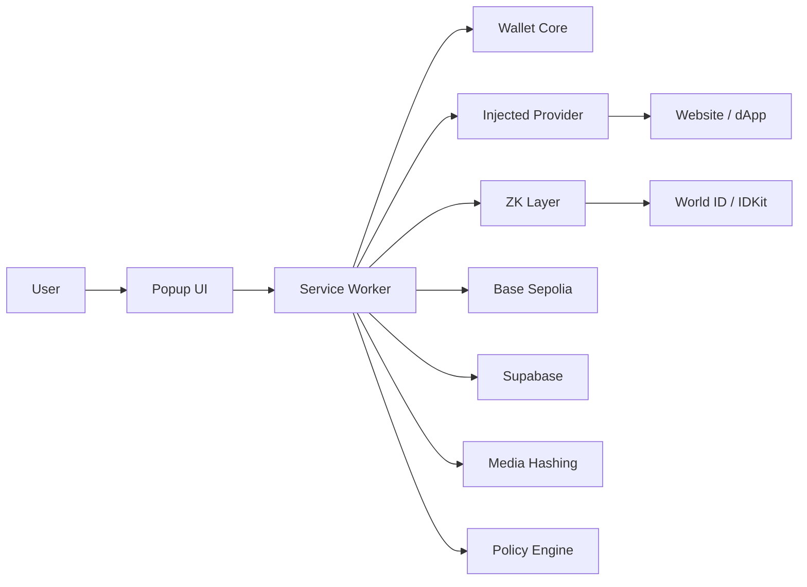
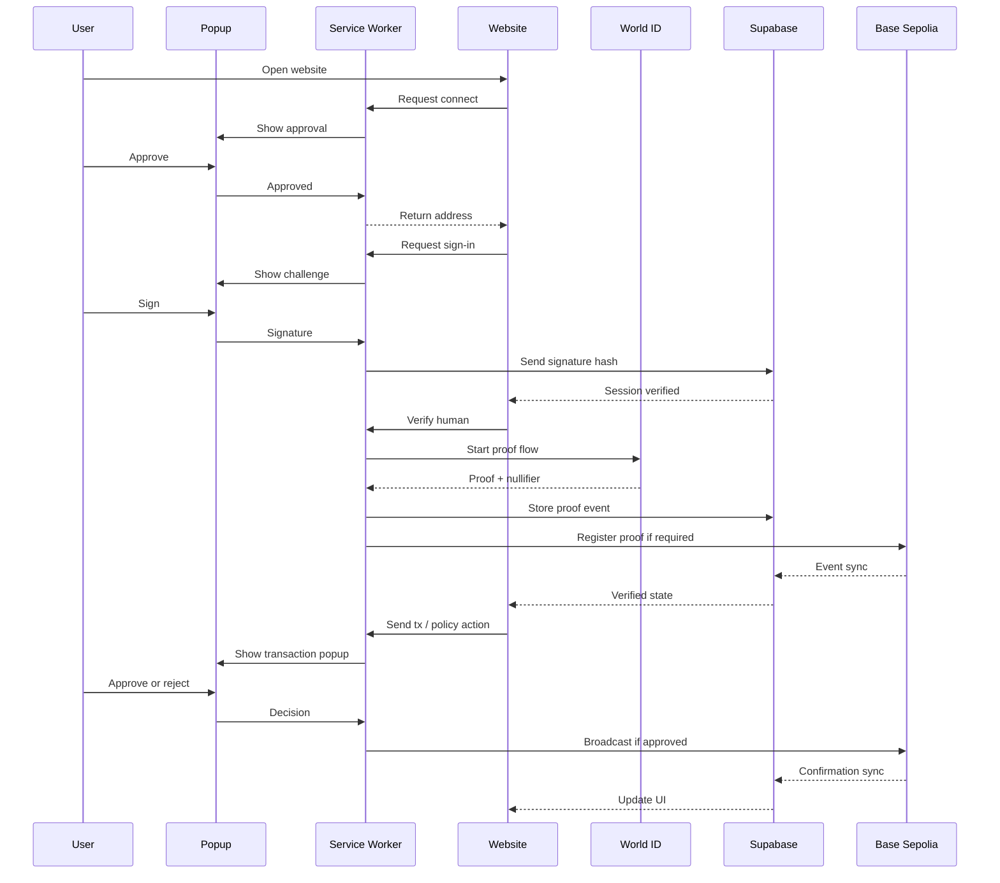

# wallet_extension.md
## Proofly Wallet Extension
### Private extension-only wallet architecture, popup flows, signing, auth, proof sync, and database handling

This document defines the extension side of Proofly as a real Chrome extension wallet.

The wallet extension must live in its own private workspace folder and must not be mixed with the public website codebase. It is the source of truth for:
- private keys,
- signing,
- approvals,
- proof state,
- policy enforcement,
- chain switching,
- secure local storage,
- popup confirmations,
- extension-provider communication.

The website is only the client. The extension is the wallet.

---

# 1. Core rule

The extension must be isolated in its own folder and its own runtime boundary.

Recommended repository layout:

```text
proofly/
├── apps/
│   ├── web/              # wallet website / dApp UI
│   └── extension/        # private wallet extension only
├── contracts/
├── supabase/
├── packages/
└── docs/
```

Inside `apps/extension`, keep the wallet logic private and self-contained.

Recommended structure:

```text
apps/extension/
├── manifest.json
├── src/
│   ├── background/
│   ├── content/
│   ├── injected/
│   ├── popup/
│   ├── options/
│   ├── wallet/
│   ├── zk/
│   ├── policy/
│   ├── chain/
│   ├── storage/
│   ├── auth/
│   ├── media/
│   ├── contracts/
│   └── shared/
├── assets/
└── public/
```

The extension should be built as a standalone package with its own environment variables, build pipeline, and deployment bundle.

---

# 2. What the extension does

The extension is responsible for:

- creating wallets,
- importing wallets,
- locking and unlocking wallets,
- generating and storing encrypted private keys locally,
- exposing a wallet provider to websites,
- signing login challenges,
- signing messages,
- signing typed data,
- signing transactions,
- launching human proof verification,
- storing proof state,
- enforcing AI permission rules,
- showing smart contract popups,
- confirming chain actions,
- hashing media locally,
- writing audit data to Supabase,
- syncing on-chain events into the wallet state.

The extension is the only place where private key control exists.

---

# 3. What the extension is not

It is not:
- the website,
- the backend,
- the database,
- a mock popup,
- a fake signing layer,
- a server-side wallet,
- a custodial vault,
- a blind transaction relay.

Nothing sensitive should be able to bypass the extension.

---

# 4. Extension architecture



### Roles
- Popup UI: shows user-facing prompts and approvals.
- Service worker: central event handler for wallet logic.
- Wallet core: keys, signing, encryption, session state.
- Injected provider: bridges the extension to websites.
- ZK layer: human verification state.
- Chain layer: transaction routing and network switching.
- Database sync: operational records and audit logs.
- Policy engine: AI leash and permission control.
- Media module: file hashing and signature capture.

---

# 5. Chrome extension runtime model

The wallet must be implemented in Manifest V3.

Important properties:
- background pages are replaced by a service worker,
- the service worker is the central event handler,
- long-lived browser state must be handled carefully,
- popup and content scripts should communicate through the service worker,
- remote code should not be injected.

The extension should use the standard Chrome extension structure and keep all wallet logic local.

---

# 6. Wallet lifecycle

## 6.1 First install
1. User installs the extension.
2. Extension opens onboarding.
3. User creates a new wallet or imports an existing wallet.
4. User sets a local password.
5. Seed phrase or imported key is encrypted locally.
6. Extension stores the encrypted payload.
7. Wallet address is derived and displayed.

## 6.2 Unlock
1. User opens the extension.
2. User enters password.
3. Extension decrypts the wallet locally.
4. Wallet session becomes active.
5. Provider is enabled for dApps.

## 6.3 Lock
1. User locks the wallet manually or via timeout.
2. Sensitive memory is cleared.
3. Provider requests require re-approval.

## 6.4 Recovery
1. User backs up the seed phrase or recovery data.
2. Recovery is kept local and user-controlled.
3. No server should be able to reconstruct the private key.

---

# 7. Provider architecture

The extension must expose an EIP-1193 compatible provider so websites can connect to it in a standard way.

Required methods:
- `eth_requestAccounts`
- `eth_accounts`
- `eth_chainId`
- `personal_sign`
- `eth_signTypedData_v4`
- `eth_sendTransaction`
- `wallet_switchEthereumChain`
- `wallet_addEthereumChain`

Required events:
- `connect`
- `disconnect`
- `accountsChanged`
- `chainChanged`

For multi-provider safety, the extension should also support EIP-6963 discovery behavior.

The website should never talk directly to the wallet database. It should only talk to the injected provider.

---

# 8. Popup flow

The popup is the wallet approval interface.

The popup should appear when the extension needs the user to approve:
- connection,
- sign-in,
- message signing,
- transaction signing,
- proof generation,
- policy creation,
- chain switching,
- contract confirmation,
- session extension,
- AI delegation.

## 8.1 Popup states
- locked
- unlocked
- connect request
- sign-in request
- signature request
- transaction request
- proof request
- policy request
- chain switch request
- approval result
- rejection result

## 8.2 Popup rules
Every prompt must show:
- who is requesting,
- what is being requested,
- which chain is involved,
- which account will sign,
- what the user is approving,
- what the result will be.

Never hide the message content or contract target.

---

# 9. Sign-in flow

The sign-in flow must be real and cryptographically valid.

## Steps
1. Website requests sign-in.
2. Website asks backend for a challenge.
3. Backend issues a nonce-based challenge.
4. Extension shows the challenge to the user.
5. User approves signing.
6. Extension signs the challenge with the active wallet.
7. Website sends signature back to backend.
8. Backend verifies the signature.
9. Backend creates a session.
10. Website updates the UI to authenticated.

## Stored data
- wallet address,
- challenge hash,
- signature hash,
- timestamp,
- session id,
- verification status.

## Security rules
- challenge must be one-time,
- challenge must expire,
- signature must be tied to one wallet,
- backend must verify before creating the session.

---

# 10. Transaction signing flow

Transactions must go through the extension approval popup.

## Steps
1. Website builds the transaction request.
2. Website asks the provider to send the transaction.
3. Extension captures the request.
4. Popup shows exact transaction details.
5. User approves or rejects.
6. Extension signs and broadcasts the transaction.
7. Transaction hash is returned to the website.
8. Website stores the hash in Supabase.
9. Chain confirmation is tracked.
10. UI updates on confirmation or failure.

## Popup fields
- chain name,
- chain id,
- contract address,
- method name,
- calldata summary,
- native token amount,
- ERC-20 token amount,
- gas estimate,
- sender address,
- recipient address,
- risk warning.

## Required handling
- user must see exactly what is being signed,
- transaction replacement events should be handled,
- failed or reverted transactions should be shown clearly,
- confirmations should be tracked until final status.

---

# 11. Proof flow

The wallet must support real proof-of-human verification.

Primary provider:
- World ID / IDKit

## Proof steps
1. User clicks Verify Human.
2. Extension launches the proof flow.
3. User completes verification.
4. Proof and nullifier are returned.
5. Extension stores the proof state locally.
6. Proof event is written to Supabase.
7. If needed, proof state is registered on-chain.
8. UI shows verified human state.

## Proof storage fields
- proof provider,
- action name,
- nullifier hash,
- proof status,
- verified at,
- wallet address,
- chain binding,
- contract tx hash if used.

## Verification rules
- do not trust client-only proof states,
- do not reuse nullifiers incorrectly,
- verify the backend record,
- verify on-chain if the action requires contract enforcement.

---

# 12. Policy engine

The wallet must enforce AI leash behavior inside the extension.

## Policy types
- spend cap,
- token allowlist,
- contract allowlist,
- chain allowlist,
- time window,
- recipient allowlist,
- method allowlist,
- session limit.

## Policy flow
1. User opens policy panel.
2. User sets limits.
3. Extension stores the policy.
4. Policy hash is written to Supabase.
5. Optional on-chain policy record is written.
6. AI agent or app requests an action.
7. Extension checks request against the policy.
8. Allowed actions are signed.
9. Denied actions are rejected with reason.

## Policy storage
- policy id,
- wallet address,
- agent id,
- spend limit,
- token list,
- contract list,
- validity window,
- status,
- hash.

---

# 13. Media hashing and signatures

The extension must support file and audio signing.

## Steps
1. User selects or records media.
2. Extension computes a local hash.
3. User approves signing.
4. Extension signs the hash with the wallet key.
5. Optional proof state is attached.
6. Hash and signature are stored in Supabase.
7. The website can later display the signed record.

## Stored data
- file hash,
- signature,
- signer address,
- proof reference,
- timestamp,
- filename or media metadata.

This gives the system a real source trail.

---

# 14. Database handling

Supabase should store operational records only.

## Suggested tables
- `wallet_profiles`
- `proof_events`
- `policy_sessions`
- `media_signatures`
- `transaction_events`
- `audit_logs`

## Write order
### For sign-in
1. challenge hash
2. signature hash
3. verified session

### For proof
1. proof provider
2. action name
3. nullifier hash
4. status
5. timestamp

### For transaction
1. wallet address
2. chain id
3. contract address
4. tx hash
5. confirmation status

### For media
1. file hash
2. signature hash
3. signer address
4. timestamp

### For policy
1. policy hash
2. policy details
3. activation state
4. expiry

## Security
- use row-level security,
- only authenticated rows should be accessible,
- use service-role access only in controlled backend functions,
- never store raw private keys.

---

# 15. Backend retrieval and sync

The extension should retrieve only the data it needs.

## It may retrieve
- current wallet profile,
- current proof state,
- current policy state,
- current transaction status,
- current session state,
- past activity records.

## It must not retrieve
- raw private key,
- raw seed phrase,
- unencrypted key material,
- privileged server secrets.

## Sync model
- local extension state is authoritative for secrets,
- Supabase is authoritative for operational logs,
- chain state is authoritative for public trust records,
- the website reflects the combined state.

---

# 16. Smart contract popups

When a contract interaction is requested, the popup must be strict.

The popup should show:
- network,
- contract address,
- method,
- inputs,
- amount,
- recipient,
- estimated gas,
- whether proof is required,
- whether policy allows it,
- whether it is safe or risky.

If proof is needed, the extension should ask for proof before final signing where applicable.

If the contract action exceeds the policy, the extension must reject it.

---

# 17. Chain support

For v1:
- Base Sepolia is the default development and test chain.

The wallet should be able to store additional chain configs later, but the wallet extension should be built around one active default chain first so the system stays clean.

The chain registry should contain:
- chain id,
- rpc endpoint,
- explorer,
- native asset,
- contract addresses,
- support level.

---

# 18. Service worker responsibilities

The service worker is the extension brain.

It should handle:
- wallet state,
- request routing,
- provider messages,
- popup approvals,
- proof state,
- policy state,
- chain switching,
- transaction metadata,
- backend sync calls.

Because Manifest V3 uses a service worker as the central event handler, the wallet should be designed around short-lived event-driven state rather than a persistent background page.

---

# 19. Content script and injected provider

The content script should:
- bridge the webpage and the extension,
- expose the provider,
- send requests to the service worker,
- return responses safely.

The injected provider should:
- implement EIP-1193,
- emit events,
- keep messages typed and validated,
- avoid direct access to secrets.

---

# 20. Security rules

- Never expose private keys to the website.
- Never store raw keys in Supabase.
- Never silently sign anything.
- Never ignore the chain context.
- Never trust backend claims without verification.
- Never trust client-only proof state for sensitive actions.
- Never bypass the popup for signing.
- Never allow the website to write privileged state directly.

---

# 21. Implementation modules

```text
src/
├── wallet/
│   ├── keys.ts
│   ├── encrypt.ts
│   ├── decrypt.ts
│   ├── derive.ts
│   └── sign.ts
├── auth/
│   ├── challenge.ts
│   ├── session.ts
│   └── verify.ts
├── zk/
│   ├── worldid.ts
│   ├── proofState.ts
│   └── nullifier.ts
├── policy/
│   ├── rules.ts
│   ├── allowlists.ts
│   └── sessions.ts
├── chain/
│   ├── config.ts
│   ├── switch.ts
│   └── tx.ts
├── media/
│   ├── hash.ts
│   └── signMedia.ts
├── contracts/
│   ├── parseCall.ts
│   └── contractInfo.ts
├── storage/
│   ├── local.ts
│   └── secure.ts
├── popup/
│   ├── views/
│   └── state.ts
└── shared/
    ├── types.ts
    └── schemas.ts
```

---

# 22. End-to-end extension flow



---

# 23. Final implementation rule

This extension should be built as a private, isolated wallet package with its own popup, service worker, provider, proof engine, policy engine, and sync pipeline.

The website may interact with it, but the website must never become the wallet.

The extension is the vault.
The popup is the approval layer.
The chain is the enforcement layer.
Supabase is the memory layer.
World ID is the proof layer.
