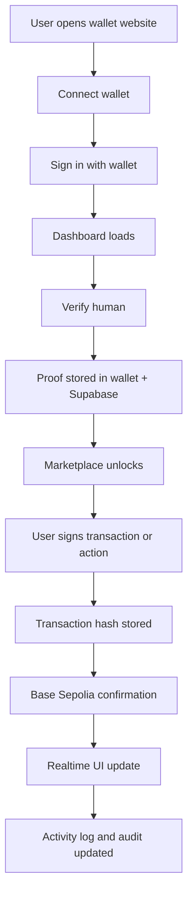

# wallet_website.md
## Proofly Wallet Website Specification
### Website behavior, sign-in, transaction signing, proof synchronization, and database handling

This document describes the website side of Proofly Wallet.

It explains what happens inside the wallet website, how the website talks to the extension wallet, how sign-in works, how transactions are prepared and confirmed, how hashes and proof records are stored, how synchronization works across browser, backend, chain, and database, and how the experience should feel like a real wallet product.

This file should be read together with `website_design.md`, which defines the visual design direction and screen composition.

---

## 1. What the website is

The Proofly Wallet website is the user-facing dApp and dashboard layer.

It is not the private key store.

The website is responsible for:
- onboarding users,
- connecting to the wallet extension,
- showing wallet state,
- triggering sign-in flows,
- requesting signatures,
- showing human verification state,
- showing AI policy state,
- showing transaction history,
- showing proof history,
- showing media signature records,
- showing task or marketplace access,
- syncing with Supabase in realtime,
- reflecting on-chain state from Base Sepolia.

The extension is the signing authority.
The website is the interaction and presentation layer.

---

## 2. Core principle

The website must never pretend to be the wallet.

It must always work as a client of the wallet extension.

The website can:
- request accounts,
- request signatures,
- request proof flows,
- request chain changes,
- display wallet state,
- display backend records.

The website cannot:
- hold raw private keys,
- silently sign on behalf of the user,
- bypass wallet prompts,
- fabricate proof state,
- override policy rules.

---

## 3. Website goals

The website should feel like a real wallet dashboard and a real dApp at the same time.

It should provide:
- a clear login and connection path,
- wallet identity visibility,
- human proof verification,
- transaction preview and submission,
- policy-based AI delegation,
- media signing,
- realtime state updates,
- audit visibility,
- a clean handoff between frontend, extension, backend, and chain.

---

## 4. Website surface map

The website should include these pages:

### Public pages
- Home
- Product overview
- Install extension
- Connect wallet
- Sign in
- Verify human
- Demo / explainer

### Wallet pages
- Wallet dashboard
- Address and network view
- Proof status view
- Transaction activity
- Signature history
- Recovery and settings

### Proof and trust pages
- Human verification
- Task access
- Identity vault
- Credential view
- Policy view

### AI pages
- Agent permissions
- Spend limit configuration
- Contract allowlist
- Session expiry management
- AI action history

### Media pages
- Voice hash signing
- File signing
- Verification records

### Admin or debug pages
- Event logs
- Proof sync status
- Contract sync status
- Supabase sync status
- Error logs

---

## 5. Website-to-extension relationship

The website communicates with the extension through the injected provider.

The website should rely on standard wallet methods such as:
- request accounts,
- sign messages,
- sign typed data,
- send transactions,
- switch chain.

This should happen through the extension provider, not directly through the backend.

### Interaction pattern
1. Website asks for action.
2. Extension shows approval UI.
3. User approves or rejects.
4. Extension returns result.
5. Website updates UI and syncs backend records.

---

## 6. Sign-in workflow

The website should support a real wallet sign-in flow.

### Sign-in flow
1. User opens the website.
2. User clicks “Connect Wallet” or “Sign In”.
3. Website requests wallet accounts.
4. Extension asks for approval.
5. User approves.
6. Website receives the wallet address.
7. Website asks the wallet to sign a challenge.
8. Extension shows the sign-in message.
9. User approves signing.
10. Website sends the signed message to backend verification.
11. Backend verifies signature.
12. Website shows the authenticated dashboard.

### What gets stored
- wallet address,
- signed challenge hash,
- auth session in backend,
- last login timestamp,
- chain context,
- proof state.

### What does not get stored
- private keys,
- seed phrase,
- raw signature prompts without purpose,
- hidden approvals.

---

## 7. Transaction workflow

The website should support user-initiated transaction flows.

### Transaction flow
1. User selects a chain.
2. User picks a contract or action.
3. Website builds the transaction request.
4. Website shows a clear preview.
5. Website sends the transaction request to the extension.
6. Extension displays the exact transaction details.
7. User approves or rejects.
8. Extension signs and broadcasts the transaction.
9. Website receives the hash.
10. Website stores the hash in Supabase.
11. Website subscribes to chain confirmation status.
12. Website marks the transaction as pending, confirmed, or failed.

### What should be visible before signing
- chain name,
- contract address,
- method name,
- amount,
- token,
- recipient,
- gas estimate if available,
- intent summary.

### What should be stored after submission
- transaction hash,
- wallet address,
- action name,
- contract address,
- chain id,
- timestamp,
- backend status.

---

## 8. Hash generation workflow

The website should track hashes for all important actions.

### Hash types
- sign-in challenge hash,
- transaction payload hash,
- proof request hash,
- policy hash,
- media file hash,
- session hash,
- audit event hash.

### Where hashes are generated
- for file hashes: locally in the browser or extension,
- for signed requests: by the wallet extension,
- for backend records: in Supabase,
- for chain records: in Solidity events or contract state.

### What to do with hashes
- store them in the database,
- associate them with wallet address,
- show them in activity logs,
- use them for verification,
- use them for audit trails.

---

## 9. Human verification workflow

The website should include a real human verification page.

### Flow
1. User opens the Verify Human page.
2. Website checks whether the wallet is connected.
3. Website launches the World ID flow through the wallet or app integration.
4. User completes verification.
5. Website receives the proof result.
6. Website writes proof state to Supabase.
7. If required, the website triggers on-chain proof registration.
8. Website updates the UI to show verified human status.

### What the website must display
- verified / not verified,
- proof provider name,
- action scope,
- timestamp,
- nullifier or proof reference,
- chain sync status.

---

## 10. AI leash workflow

The website should allow the user to manage AI permissions.

### Flow
1. User opens the AI permissions page.
2. User defines:
   - spend cap,
   - allowed contracts,
   - allowed tokens,
   - time window,
   - chain scope.
3. Website sends the policy request to the extension.
4. Extension stores or signs the policy.
5. Website writes policy metadata to Supabase.
6. Optional on-chain policy registry is updated.
7. AI agent requests an action.
8. Website and extension check policy.
9. Allow or deny is shown in the dashboard.

### What the website must show
- active policy,
- policy start and end,
- current usage,
- remaining allowance,
- denied actions,
- approved actions.

---

## 11. Media signing workflow

The website should support voice and file signing.

### Flow
1. User uploads or records media.
2. Website computes or forwards the local hash flow.
3. Extension signs the media hash.
4. Proof state is attached if the user is human verified.
5. Website stores hash and signature in Supabase.
6. Website shows verification status to the user.
7. Recipient-side verification can later check the record.

### Website display
- file name,
- file hash,
- signature,
- proof status,
- signer address,
- timestamp.

---

## 12. Database synchronization

The website should sync with Supabase in realtime.

### Tables
- `wallet_profiles`
- `proof_events`
- `policy_sessions`
- `media_signatures`
- `task_submissions`
- `audit_logs`
- `transaction_events`

### Sync rules
- wallet connection state can be stored in the user session,
- proof results go to `proof_events`,
- policy records go to `policy_sessions`,
- media records go to `media_signatures`,
- transaction results go to `transaction_events`,
- all important changes should appear in realtime.

### Realtime behavior
When the database changes, the website should update without a manual refresh.

Examples:
- proof accepted,
- transaction confirmed,
- policy updated,
- signature recorded,
- session expired,
- task unlocked.

---

## 13. On-chain synchronization

The website should keep contract state and backend state aligned.

### Chain source
Base Sepolia only for v1.

### Sync flow
1. Wallet signs or submits a transaction.
2. Transaction lands on Base Sepolia.
3. Contract emits an event.
4. Backend indexer listens for the event.
5. Supabase stores the event.
6. Website receives realtime update.
7. UI changes from pending to confirmed.

### Important rule
The website should never rely only on frontend success messages.
It should wait for a real chain receipt or backend-confirmed event.

---

## 14. Suggested website pages in detail

### Home
Explains what Proofly Wallet is, why the user should connect, and what the product does.

### Connect Wallet
Lets the user connect through the extension.

### Sign In
Handles signed challenge login.

### Dashboard
Shows wallet address, network, proof state, and recent activity.

### Verify Human
Starts the ZK proof flow.

### Marketplace
Shows tasks that require human proof.

### AI Permissions
Lets the user manage delegated AI behavior.

### Media Signing
Lets the user sign audio or files.

### Activity Log
Shows signatures, proofs, transactions, and backend sync.

### Settings
Shows recovery, network selection, privacy, and security controls.

---

## 15. Sync states the website must handle

The website should understand these states:

- disconnected,
- connected,
- signing in,
- authenticated,
- human unverified,
- human verified,
- proof pending,
- proof confirmed,
- transaction pending,
- transaction confirmed,
- transaction failed,
- policy active,
- policy expired,
- session active,
- session expired.

---

## 16. Error handling

The website must show clear errors.

Examples:
- wallet not installed,
- wallet locked,
- user rejected signature,
- invalid proof,
- wrong chain,
- transaction reverted,
- backend unavailable,
- sync delayed,
- policy denied action.

Every error should explain what the user can do next.

---

## 17. Suggested folder structure

```text
apps/web/
├── app/
│   ├── page.tsx
│   ├── wallet/
│   ├── signin/
│   ├── verify/
│   ├── marketplace/
│   ├── agent/
│   ├── media/
│   ├── activity/
│   └── settings/
├── components/
│   ├── wallet/
│   ├── auth/
│   ├── proof/
│   ├── tx/
│   ├── policy/
│   ├── media/
│   └── shared/
├── lib/
│   ├── supabase/
│   ├── chain/
│   ├── wallet/
│   ├── zk/
│   ├── auth/
│   └── utils/
├── hooks/
├── types/
└── styles/
```

---

## 18. Website responsibilities by layer

### UI layer
- render pages,
- show wallet state,
- show actions,
- show history.

### Interaction layer
- call provider methods,
- manage wallet prompts,
- handle loading and pending states.

### Backend layer
- write profiles,
- write proofs,
- write policies,
- write logs,
- sync receipts.

### Chain layer
- submit transactions,
- wait for confirmations,
- reflect contract events.

---

## 19. End-to-end website flow



---

## 20. Database write order

For a clean real system, the website should write records in this order:

### For sign-in
1. wallet address
2. challenge hash
3. signature
4. verified session

### For proof
1. proof provider
2. proof action
3. nullifier or proof reference
4. verification status
5. timestamp

### For transaction
1. wallet address
2. contract address
3. method name
4. chain id
5. tx hash
6. confirmation status

### For media signing
1. file hash
2. signature
3. signer address
4. proof state
5. timestamp

### For policy
1. policy id
2. wallet address
3. allowance rules
4. expiry
5. status

---

## 21. Final sync model

The best operating model for Proofly is:

- Extension owns the keys.
- Website owns the experience.
- Supabase owns operational memory.
- Chain owns public trust records.
- ZK provider owns human proof.

This keeps the system secure, readable, and scalable.

---

## 22. One-line definition

The Proofly wallet website is the complete user-facing control room for sign-in, proof verification, transaction approval, media signing, AI permissioning, and realtime trust synchronization, while the extension remains the real wallet authority.
