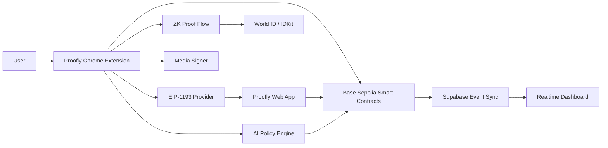
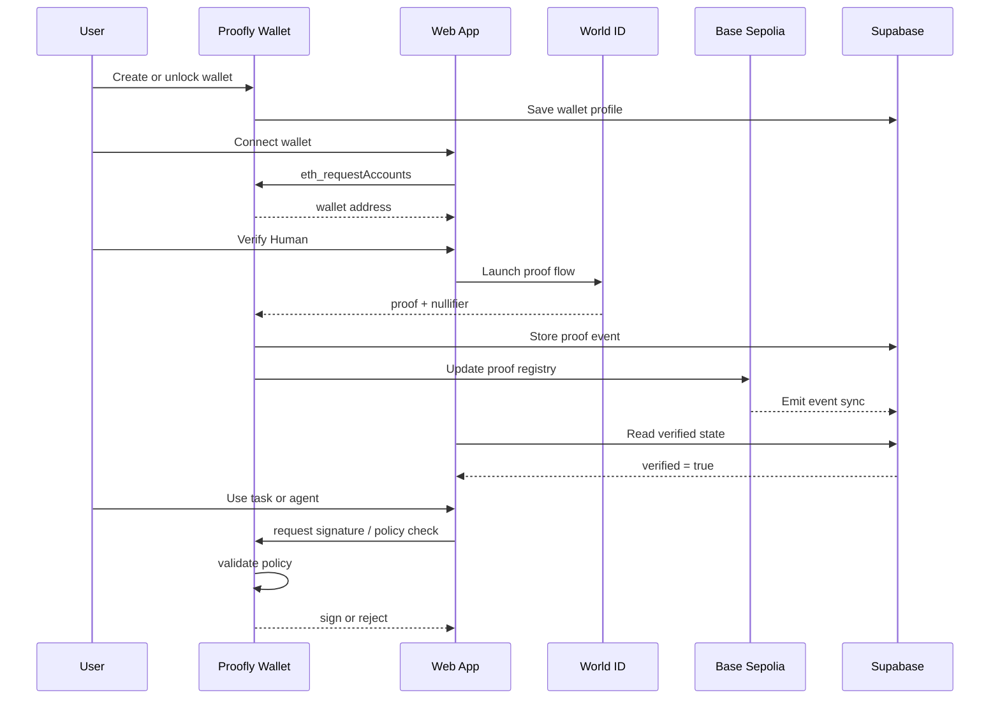
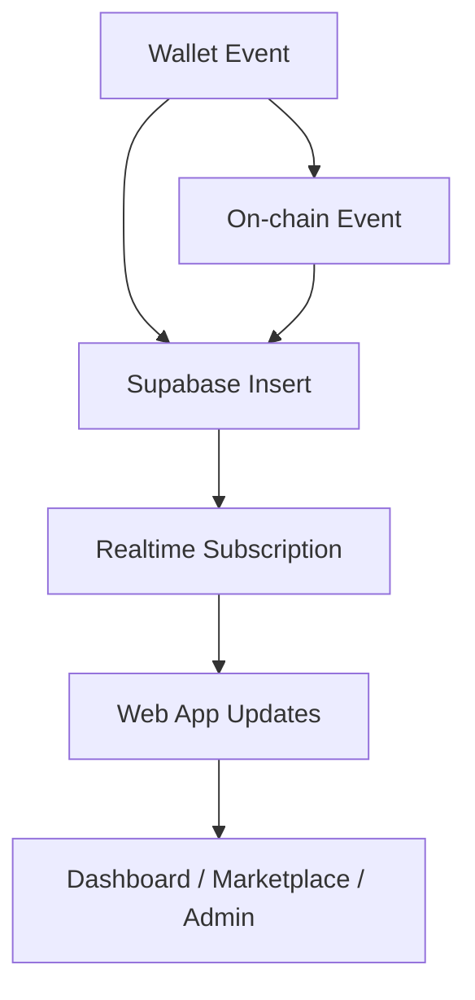

# Proofly Workflow
## End-to-End Product, Wallet, ZK, Voice, Bot Detection, and AI Leash Flow

This document describes how Proofly works from first installation to full trust verification, how the wallet extension interacts with the web app, how zero-knowledge proof flows are handled, how media signatures are attached, how bot detection is enforced, and how the AI leash policy engine governs delegated actions.

It is written as an implementation-facing workflow so the team can use it directly while building the system.

---

# 1. What Proofly does

Proofly is a wallet-native trust system for the AI era.

It allows a user to:
- create or import a real wallet,
- unlock it locally,
- prove they are a human,
- connect to dApps with standard wallet behavior,
- sign messages, transactions, and media hashes,
- authorize AI agents with strict limits,
- unlock human-only marketplace or task flows,
- record proof and policy state in a real backend,
- verify actions on a single EVM testnet and later extend to mainnet.

The wallet is the trust anchor.  
The dApp is the interface.  
The blockchain is the enforcement layer.  
Supabase is the operational memory.  
World ID is the proof-of-human source.

---

# 2. Core components

## 2.1 Chrome extension wallet
This is the primary product.

It contains:
- key generation and import
- encrypted local storage
- password unlock
- message signing
- transaction signing
- typed-data signing
- provider injection
- chain switching
- proof launch
- policy engine
- media signature engine
- local audit trail

## 2.2 Web app
This is the dApp and dashboard.

It contains:
- landing page
- connect wallet flow
- verify human flow
- task marketplace
- AI agent console
- media signing view
- verification dashboard
- admin or debug pages

## 2.3 Smart contracts
These live on Base Sepolia in v1.

They contain:
- human verification registry
- policy registry
- session registry
- task gating logic
- on-chain event emission

## 2.4 Supabase backend
This stores operational data only.

It contains:
- wallet profiles
- proof events
- policy sessions
- media signatures
- task submissions
- audit logs
- realtime updates

## 2.5 Zero-knowledge proof provider
This is the human verification engine.

Primary provider:
- World ID / IDKit

Optional future provider:
- Polygon ID for credential proofs

---

# 3. Repository structure

```text
proofly/
├── apps/
│   ├── web/
│   │   ├── app/
│   │   ├── components/
│   │   ├── hooks/
│   │   ├── lib/
│   │   └── pages/
│   └── extension/
│       ├── src/
│       │   ├── background/
│       │   ├── content/
│       │   ├── injected/
│       │   ├── popup/
│       │   ├── options/
│       │   ├── wallet/
│       │   ├── zk/
│       │   ├── policy/
│       │   ├── media/
│       │   └── shared/
│       └── manifest.json
├── contracts/
│   ├── ProoflyRegistry.sol
│   ├── ProoflyPolicy.sol
│   ├── ProoflySession.sol
│   └── ProoflyTaskGate.sol
├── supabase/
│   ├── migrations/
│   ├── functions/
│   ├── policies/
│   ├── storage/
│   └── seed/
├── packages/
│   ├── chain/
│   ├── shared/
│   ├── wallet-core/
│   ├── zk/
│   └── ui/
└── docs/
    ├── workflow.md
    ├── implementation.md
    ├── technicalstack.md
    ├── architecture.md
    └── api.md
```

---

# 4. High-level system diagram



---

# 5. Detailed workflow by user journey

## 5.1 First install and wallet creation

### Goal
Create a real wallet inside the extension.

### Steps
1. User installs the Proofly Chrome extension.
2. The extension opens the onboarding screen.
3. User chooses:
   - create new wallet, or
   - import existing wallet.
4. If creating:
   - a mnemonic is generated locally,
   - a private key is derived locally,
   - the key is encrypted with a user password,
   - the encrypted payload is saved in browser storage.
5. If importing:
   - user enters seed phrase,
   - extension derives keypair,
   - key is encrypted and stored locally.
6. Extension shows:
   - wallet address,
   - active chain,
   - lock state,
   - proof state,
   - policy state.

### Output
- wallet exists,
- wallet is locally secured,
- wallet can sign and connect to dApps.

---

## 5.2 Wallet unlock

### Goal
Unlock local signing authority.

### Steps
1. User opens the extension.
2. User enters password.
3. Extension decrypts the local key payload.
4. The wallet session becomes active.
5. Provider methods become available to the browser.
6. The popup shows the unlocked state.

### Output
- user can approve dApp requests,
- wallet is ready for proof and signing actions.

---

## 5.3 Connect wallet to dApp

### Goal
Let a website connect to Proofly.

### Steps
1. User opens the Proofly web app.
2. The app requests `eth_requestAccounts`.
3. The injected provider relays the request to the extension.
4. The extension shows a connection approval screen.
5. User approves or rejects.
6. If approved, the address is returned.
7. The web app stores the connected state.

### Output
- dApp knows the user’s wallet address,
- no private key leaves the extension,
- connection is standard and interoperable.

---

## 5.4 Human proof flow

### Goal
Prove the user is a real human without revealing identity.

### Steps
1. User clicks “Verify Human.”
2. The app or extension launches the World ID / IDKit flow.
3. The user completes the proof process.
4. A proof and nullifier are returned.
5. The wallet records the proof state locally.
6. The backend records the verification event in Supabase.
7. If needed, a contract call updates on-chain trust state.
8. The UI changes to “Human Verified.”

### Output
- anti-bot trust is established,
- human-only actions can be unlocked,
- the user remains privacy-preserved.

---

## 5.5 Task marketplace flow

### Goal
Unlock tasks only for verified humans.

### Steps
1. User opens the marketplace page.
2. The app checks wallet connection.
3. The app reads proof state.
4. If proof state is valid, task cards become active.
5. If not verified, only preview mode is shown.
6. User selects a task.
7. User signs the submission or proof-bearing action.
8. Task submission is stored in Supabase.
9. Contract or event logs confirm status if needed.
10. The dashboard updates in realtime.

### Output
- marketplace is bot-resistant,
- submission records are auditable,
- verification unlocks real actions.

---

## 5.6 Voice and media signing flow

### Goal
Let a wallet sign a voice file or media payload.

### Steps
1. User records or uploads audio.
2. Extension computes the file hash locally.
3. Wallet shows the file metadata for confirmation.
4. User approves the signature.
5. The wallet signs the hash.
6. Proof state can be attached if the user has verified humanity.
7. Hash, signature, and proof reference are saved in Supabase.
8. Recipient apps can verify source authenticity.

### Output
- media becomes tamper-evident,
- source attribution is preserved,
- proof-backed human origin is available.

---

## 5.7 AI leash flow

### Goal
Allow an AI agent to act only inside human-defined limits.

### Steps
1. User opens the AI policy screen.
2. User defines:
   - spend limit,
   - allowed contracts,
   - allowed assets,
   - time window,
   - chain scope.
3. Extension stores the policy locally.
4. Policy hash is written to Supabase and optionally on-chain.
5. AI agent requests an action.
6. Wallet checks the request against policy rules.
7. If allowed, the wallet signs.
8. If denied, the wallet rejects and shows the reason.
9. The decision is logged.

### Output
- AI can act,
- but only under explicit human policy,
- spending and contract access remain bounded.

---

# 6. Full end-to-end trust pipeline



---

# 7. Folder-level implementation map

## `apps/extension`
This folder should contain the whole wallet logic.

### Subfolders
- `background/` for service worker orchestration
- `content/` for browser page bridge
- `injected/` for provider injection into websites
- `popup/` for wallet UI
- `options/` for settings and backup
- `wallet/` for keys, signing, chain logic
- `zk/` for proof-provider integration
- `policy/` for AI leash
- `media/` for file hashing and signing
- `shared/` for common types and helpers

## `apps/web`
This folder should contain the product UI.

### Pages
- home
- wallet connect
- verify human
- marketplace
- task detail
- media signing
- AI agent console
- dashboard
- admin

## `contracts`
Contains verified trust logic.

### Contract responsibilities
- proof registry
- policy registry
- session registry
- task gate

## `supabase`
Contains all app state persistence.

### Tables
- `wallet_profiles`
- `proof_events`
- `policy_sessions`
- `media_signatures`
- `task_submissions`
- `audit_logs`

---

# 8. Real-time data flow



### Meaning
Every critical action should appear in the app almost immediately through Supabase Realtime. On-chain events are indexed into the backend so the UI stays current.

---

# 9. Verification and trust states

The wallet should track these states:

- uninitialized
- locked
- unlocked
- wallet created
- wallet imported
- dApp connected
- human verified
- credential verified
- policy active
- session active
- task unlocked
- signature approved
- signature rejected
- chain switched
- proof expired
- policy expired

These states should drive the UI and control what actions are available.

---

# 10. Security workflow

## Wallet security
- private keys stay local,
- encryption is mandatory,
- passwords are never sent to the backend,
- signature prompts must be explicit,
- chain context must be visible.

## Backend security
- Supabase RLS everywhere,
- Edge Functions for privileged writes,
- validated payloads only,
- no public access to sensitive rows.

## Proof security
- nullifiers must be tracked,
- proof reuse should be prevented where required,
- only verified proof results should unlock protected actions.

## Contract security
- contract addresses must be fixed per environment,
- only approved writes should change trust state,
- events should be emitted for every critical update.

---

# 11. Testnet and real network behavior

Proofly should be built with testnet-first deployment, but the wallet must remain capable of real-network operation.

## Testnet mode
- Base Sepolia contract addresses,
- test RPC,
- test funding,
- test proof flow,
- test backend sync.

## Real network mode
- Base mainnet support in wallet config,
- real chain IDs,
- production wallet behavior,
- same signing and provider logic.

The wallet should not be hardcoded to testnet-only assumptions.

---

# 12. Suggested build sequence

## Phase 1
- scaffold repository,
- build wallet extension shell,
- implement local wallet create/import/unlock,
- implement EIP-1193 provider.

## Phase 2
- build Next.js app,
- connect wallet,
- read chain and address state.

## Phase 3
- integrate World ID proof flow,
- store verification state,
- unlock marketplace.

## Phase 4
- implement contracts on Base Sepolia,
- sync proof and policy events to Supabase.

## Phase 5
- add AI leash,
- add media signing,
- add realtime dashboards.

## Phase 6
- polish UI,
- add error handling,
- finalize demo route,
- harden security.

---

# 13. Demo path

The cleanest demo sequence is:

1. install wallet,
2. create wallet,
3. connect to web app,
4. verify human,
5. unlock task marketplace,
6. sign media or submission,
7. create AI policy,
8. let an AI request pass or fail based on policy.

This shows every core part of Proofly in one flow.

---

# 14. Final architecture summary

Proofly is a real wallet-first trust system.

It works as:
- a Chrome extension for identity and signing,
- a web app for user interaction,
- a ZK proof system for human verification,
- a blockchain layer for trust enforcement,
- a backend for realtime state and auditability.

Everything in the product should map to one of those layers.

---

# 15. One-line operational definition

A user opens Proofly Wallet, proves they are human, signs actions, and controls AI permissions through a real extension, real contracts, and real realtime backend state.
